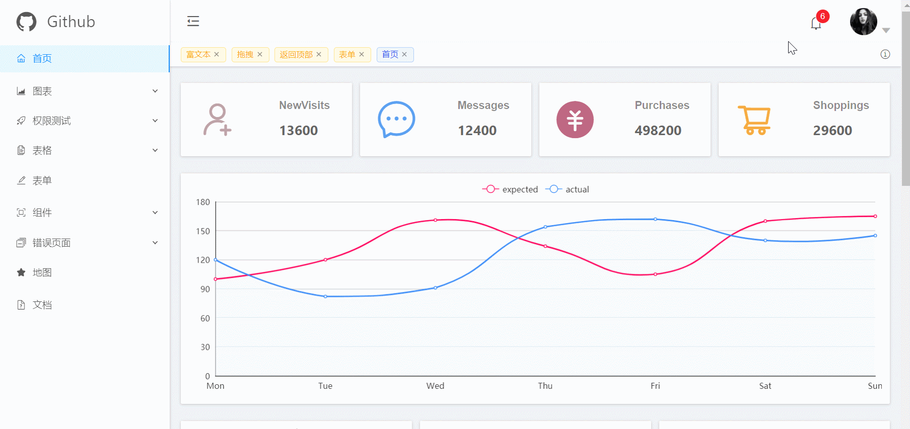
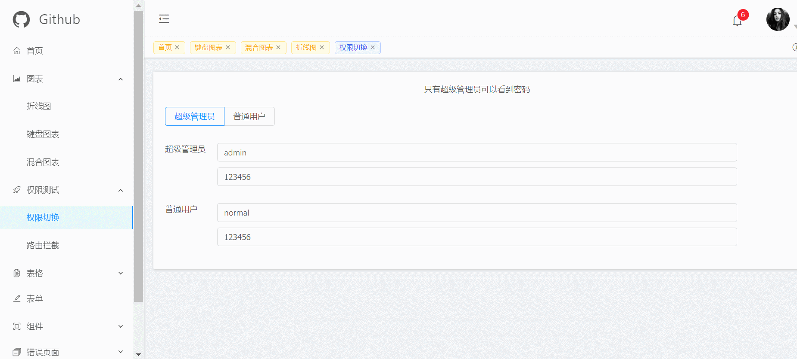
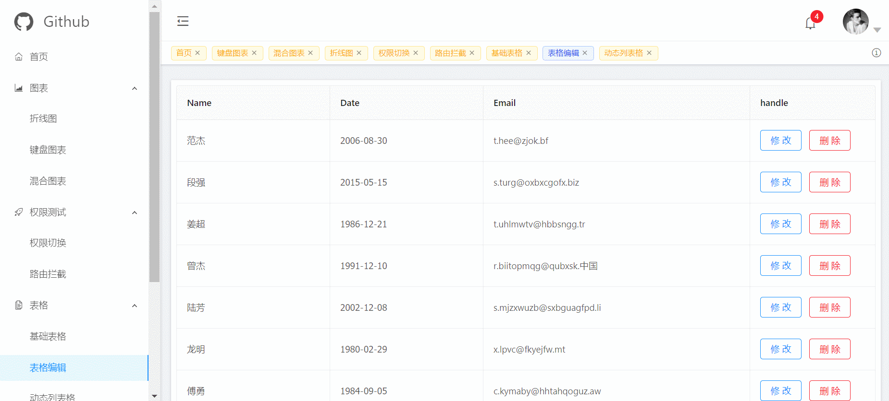

# react-admin-antd

### 前言

> 基于react和antd的后台管理系统，支持响应式，IE10+

- [预览地址]()(已增加响应式，可手机预览😄)
- 该项目基于[create-react-app](https://github.com/facebook/create-react-app)创建
### 依赖模块
- [react@16.3.2](https://facebook.github.io/react/)
- [react-router@4.2.2](https://react-guide.github.io/react-router-cn/)(<span style="color: rgb(243,121,52);">注意，v4和v3的使用区别差距较大，坑也比较多，自行斟酌</span>)
- [react-redux]() 状态管理库;用redux-logger打印日志，方便调试;用redux-thunk实现异步操作
- [css-modules@4.7.2](https://react-guide.github.io/react-router-cn/)(<span style="color: rgb(243,121,52);">避免样式命名冲突，书写方式也更简单
一般小项目用不到</span>)
- [antd@3.0.1](https://ant.design/index-cn)(<span style="color: rgb(243,121,52);">蚂蚁金服开源的react ui组件框架,精美简约</span>)
- [axios@0.16.1](https://github.com/mzabriskie/axios)(<span style="color: rgb(243,121,52);">一个常用的http请求库，可以实现全局请求拦截，响应拦截</span>)
- [echarts@4.1.0](https://github.com/apache/incubator-echarts)(<span style="color: rgb(243,121,52);">可视化图表，习惯用这个了，同款推荐 [echarts-for-react](https://github.com/hustcc/echarts-for-react)</span>)
- [react-draft-wysiwyg@1.12.13](https://github.com/jpuri/react-draft-wysiwyg)(<span style="color: rgb(243,121,52);">基于react的富文本封装</span>)
- [react-sortable-hoc@0.7.2](https://github.com/clauderic/react-sortable-hoc)(<span style="color: rgb(243,121,52);">简单的拖拽模块</span>)
- [react-transition-group@2.3.1](https://github.com/reactjs/react-transition-group)(<span style="color: rgb(243,121,52);">用来实现过渡效果，如果你用过vue的transition，这玩意也差不多</span>)
- [react-particles-js@2.2.0](https://github.com/Wufe/react-particles-js)(<span style="color: rgb(243,121,52);">用来实现登录页背景的粒子效果</span>)


### 项目截图
#### 首页
 

#### 标签页缓存功能
 

#### 权限切换
 

#### 登录页
 

#### 表格编辑
 


### 代码目录
```js
+-- build/                                  ---打包的文件目录
+-- config/                                 ---npm run eject 后的配置文件目录
+-- node_modules/                           ---npm下载文件目录
+-- public/                                 
|   --- index.html							---首页入口html文件
|   --- images							---项目图片
+-- src/                                    ---主要代码
|   +-- axios                               ---http请求库
|   |    --- index.js
|   +-- components                          ---所有可复用组件，公用组件
|   |    +-- backtotop                      ---返回顶部组件
|   |    |    --- ...   
|   |    +-- chart                         ---图表组件
|   |    |    --- ...   
|   |    +-- taglist                      --- 标签按钮
|   |    |    --- ...   
|   |    +-- map                      ---腾讯地图
|   |    |    --- ...   
|   |    +-- wysiwyg                          --- 富文本
|   +-- utils                               --- 工具文件存放目录
|   +-- views                               --- 路由页面，对应左侧菜单栏，每一个文件夹都是一个页面
|   +-- router                               --- 路由相关
|   |    +-- index.js                      --- content视图区的(src/views/layout/Content.jsx)的路由配置
|   |    |    --- ...   
|   |    +-- menus.js                         --- 左侧菜单栏的路由配置
|   |    |    --- ...   
|   +-- redux                               --- 状态管理
|   |    +-- store.js                      --- store对象
|   |    |    --- ...   
|   |    +-- action                         --- 所有action
|   |    |    --- ...   
|   |    +-- reducers                      --- 所有reducers
|   --- App.js                              --- 组件入口文件
|   --- index.js                            --- 项目入口文件
--- .env                                    --- 启动项目自定义端口配置文件
--- .eslintrc.js                               --- 自定义eslint配置文件，包括增加的react jsx语法限制
--- package.json                                    
```
### 文档 

#### 路由

- 路由的跳转事件的三种获取方式

    1. withRouter 高阶函数
    ```js
      import { withRouter } from 'react-router-dom'
      const Component = props=>{
          const {history} = props
          return (
            <div onClick={history.push('/')}>点击跳转路由</div>
          )
      }
      export default withRouter(Component)
    ```

    2. 通过context拿到history对象，实现跳转
    ```js
      import PropTypes from 'prop-types'
      const Component = (props,context)=>{
          const {history} = context.router
          return (
             <div onClick={history.push('/')}>点击跳转路由</div>
          )
      }
      Component.contextTypes = {
        router: PropTypes.object.isRequired
      }

      export default Component
    ```

#### 样式模块化

- 全局样式
  直接创建一个样式文件xxx.less
  ```js
  import './index.less'
  <div className= 'box'></div>
  ```
- css模块化
创建一个文件xxx.module.less的样式文件,以module.less会后缀的样式文件里的class，会自动添加hash值，从而实现样式模块化，避免class的命名冲突
  ```js
  import CSSModules from 'react-css-modules'
  import styles from '../index.module.less'
  <div
      styleName='box'
  />
  export default CSSModules(Component,styles)
  ```
#### 登录逻辑

发送登录请求后，后台验证返回token，接着再发送getUserInfo请求，获取用户信息（头像、姓名等）


#### 权限验证
权限由前端控制，根据后台roles生成路由表和菜单栏

#### 多环境

设置不同的环境变量
```js
// package.json
"build:prod": "set REACT_APP_XXX= 'XXX' && npm run build",
"build:sit": "set REACT_APP_XXX= 'XXX' && npm run build"
```

之后可以在代码里自行判断
if(process.env.REACT_APP_XXX === 'xxx'){
  ...
}


### 安装运行，打包
```js
npm i
```
##### 启动项目
```js
npm start
```
##### 打包项目
```js
npm run build
```

##### 测试打包后的项目
```js
serve -s build
```


